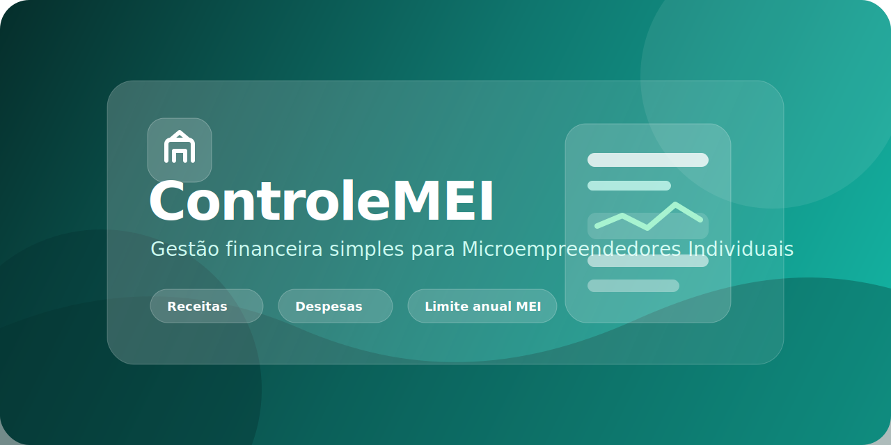

  

# ControleMEI

Sistema voltado para o controle financeiro de Microempreendedores Individuais (MEI).

---

## Sobre o projeto

O ControleMEI foi desenvolvido para facilitar a gestão financeira de pequenos negócios, permitindo controle simples e eficiente de:

- Receitas
- Despesas
- Limite anual do MEI
- Organização financeira geral

---

## Objetivo

Ajudar microempreendedores a manter o controle financeiro sem complicação, evitando problemas com faturamento e organização.

---

## Futuras funcionalidades

- Dashboard financeiro
- Importação de notas fiscais
- Integração com APIs de CNPJ
- Relatórios mensais e anuais

---

## Tecnologias

(Espaço para você adicionar conforme o projeto evoluir)

---

## Autor

Hugo Rios
